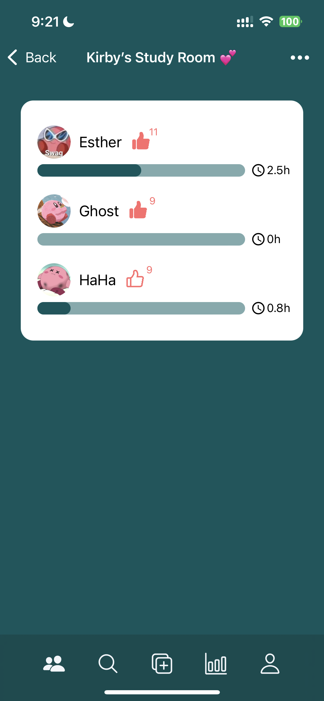

# StudySphere: Focus & Friends

  

NEU CS5520 Spring 2024

Group Members: Haoning Wang, Zhixiao Wang

## App Description
*Elevate Your Learning with StudySphere: Focus & Friends – Where Focus Meets Friendship!* 😉

In today's fast-paced world, finding the right balance between **productivity** and **social interaction** can be challenging. StudySphere: Focus & Friends is here to revolutionize the way you study, track, and share your academic journey! This innovative app combines the proven effectiveness of focused study sessions with the motivational power of social connectivity, making it the perfect tool for anyone looking to enhance their learning!

StudySphere: Focus & Friends is mainly designed for students aged above 14 who are seeking to improve their study habits and eager to use technology for a more organized, efficient, and interactive study experience.

## Table of Contents
- [StudySphere: Focus \& Friends](#studysphere-focus--friends)
  - [App Description](#app-description)
  - [Table of Contents](#table-of-contents)
  - [Explore StudySphere on YouTube](#explore-studysphere-on-youtube)
  - [Getting Started](#getting-started)
    - [Prerequisites](#prerequisites)
    - [Firebase Configuration](#firebase-configuration)
    - [Create an `.env` file](#create-an-env-file)
    - [Installation and Running](#installation-and-running)
  - [Current State](#current-state)
    - [Iteration 3 (April 21, 2024)](#iteration-3-april-21-2024)
    - [Iteration 2 (April 11, 2024)](#iteration-2-april-11-2024)
    - [Iteration 1 (March 28, 2024)](#iteration-1-march-28-2024)
  - [Member Contribution](#member-contribution)
  - [Firebase Rules](#firebase-rules)
  - [External APIs](#external-apis)
  - [User Guide](#user-guide)

## Explore StudySphere on YouTube
Click below for a full demo: [StudySphere App Demo](https://www.youtube.com/watch?v=-Obi2hcmABA)

## Getting Started
### Prerequisites
Prior to starting, make sure your machine has the following software installed:
* [Node.js](https://nodejs.org/en): This installation includes npm (Node Package Manager), which is used to manage software packages.
### Firebase Configuration
This project uses Firebase Firestore as the backend database. To set up Firebase for your app:
1. Start by creating a project in the [Firebase console](https://console.firebase.google.com/).
2. Once your project is created, enable Cloud Firestore through the console.
3. Access your project settings to obtain your Firebase configuration object.

### Create an `.env` file
Create a new file named .env in the root folder of your project and paste the following, replacing the placeholder values with your actual Firebase credentials. You will also need API keys for both the Pexels API and Google Maps.

* Pexels API key: See the official [Pexels API documentation](https://www.pexels.com/api/documentation/) for details on how to obtain your key. For now, you can use [my Pexels API](#external-apis).
* Google Maps API Key: To use Google Maps services, you will need a Google Maps API key. You can obtain one by visiting the [Google Maps Platform](https://mapsplatform.google.com/).

```
apiKey="YOUR_API_KEY"
authDomain="YOUR_AUTH_DOMAIN"
projectId="YOUR_PROJECT_ID"
storageBucket="YOUR_STORAGE_BUCKET"
messagingSenderId="YOUR_MESSAGING_SENDER_ID"
appId="YOUR_APP_ID"
mapsApiKey="YOUR_GOOGLE_MAP_API_KEY"
pexelsApiKey="YOUR_PEXELS_API_KEY"
```

### Installation and Running
To get StudySphere up and running on your system, follow these steps:
**1. Clone the repository.**
Use Git to clone the StudySphere's repository to your machine.
```
git clone https://github.com/Esther2524/StudySphere.git
```
**2. Install dependencies:**
Navigate to the cloned repository's directory and install the required dependencies.
Navigate to the cloned repository's directory and install the required dependencies.
```
npm install
```
**3. Run the app:**
Once the dependencies are installed, you can start the app using Expo CLI.
```
npx expo start
```
Alternatively, you can start the app with npm:
```
npm start
```

## Current State
### Iteration 3 (April 21, 2024)
* Summary of Iteration 3
  1. Local Notification Feature
* Functionality Implementation
  * **Focus Tasks**: 
     * **Creation and Display**: Users can create personalized focus tasks, specifying title, duration, and background picture for the standby screen. All focus tasks are displayed on the main screen for easy access.
     * **Interactive Map**: Users can specify the location for each focus task using an interactive map interface, and this location will then be displayed on a static map. Setting a focus task's location is optional, and users can edit or delete it.
     * **Camera Usage for Background Pictures**: Users can take a picture, choose from their photo album, or select a random one as the background picture for the study session. Setting a background picture is optional, and users can edit or delete it when adding a new focus task, or access the standby screen to select a random one.
     * **Modification**: Users can edit or delete a focus task by tapping the left part of its card.
     * **Start a Focus Session**: The "Start" button on the right initiates a distraction-free study session (Pomodoro) with a countdown timer. Random quotes will be displayed on the standby screen. Users can set a custom background picture, use the default one, or refresh to get a random background picture by pressing the "refresh" button in the top right corner.
     * **Session Completion**: Users can choose to leave the session before the countdown ends or let it finish automatically.
     * **Reminder**: Users can set a notification to remind them to use this app for a study session, based on the repeat mode they choose (Daily, Weekdays, Weekends) and the specific time they set. Users have the option to delete this notification.
     * **Completion Tracking**: Each focus task displays the number of times it has been completed without interruption today.
  * **Groups**:
     * **Creation and Display**: Users can create a new study group and set the target study hours for all members in the group. Groups will be diplayed as a card, with the name of the group, number of group members, and target study hours.
     * **Modification**: The group owner is the one who creates the group. Only the group owner can edit the group's name and target study time for all group members. If the group owner leaves the group, it will be dismissed.
     * **Membership**: Group members can leave a previously joined study group.
     * **Discovery**: Users can search for and join study groups. 
     * **Study Time Display**: Users can view detailed information about each group by tapping on it. This includes the names and the avatars of group members and study time of all group members.
     * **Member Interaction**: Group memebers can acknowledge other members' achievements with a "like" feature.
  * **Dashboard**:
    * **Daily Overview**: Provide a summary of the user’s daily study activities, including total study hours, the number of breaks taken, and the number of sessions completed without interruptions.
    * **Daily Task Breakdown**: Display the daily proportion of study time dedicated to each focus task on a pie chart.
    * **Weekly Study Time Distribution**: Display the distribution of the user's study time over the week on a bar chart to show to the study trend.
  * **Profile**: 
    * **Personal Information Display**: Users can view their name, email, and avatar.
    * **Map Display**: Users can view all their own focus tasks' locations on a static map.
    * **Modification**: Users can edit their username and avatar for personalization. They can take a picture or choose from their photo album to set as their avatar.
    * **Log out**: Users can log out.

* Navigation Implementation and CRUD operations to Firestore
   * Auth Stack Navigator
     * This navigator is the entry point for unauthenticated users, directing them to either log in or sign up. It incorporates two screens, LoginScreen and SignupScreen, ensuring users can securely access their accounts or create new ones. The Auth Stack Navigator is conditionally rendered based on the authentication state managed through Firebase Authentication. If a user is not authenticated, this navigator is displayed, guiding the user through the authentication process.
   * App Tab Navigator
     * Upon successful authentication, the App Tab Navigator becomes the heart of the application's user interface. It organizes the app's main features into five tabs: Focus List, Study Group, Find Group, Dashboard, and Profile. This navigator enhances the user experience by providing a bottom tab bar for easy navigation between the app's primary features.
   * Focus Stack Navigator
     *  Nested within the App Tab Navigator, the Focus Stack Navigator handles the navigation related to focus tasks. It starts with the FocusScreen, where users can manage their focus tasks. The StandbyScreen is accessible from here, presented modally, to offer users a distraction-free environment for focused study sessions.
   * Group Stack Navigator
     * Nested within the App Tab Navigator, the Group Stack Navigator manages study groups. It begins with the StudyGroupScreen, allowing users to explore and manage their study groups. The GroupDetailsScreen provides detailed information about a specific study group. This navigator illustrates the application's group management features, including joining, creating, and interacting with study groups.
   * Firestore CRUD Operations
     * **Authentication Data**: Manage user accounts, including sign-up and login。
     * **Focus Tasks and Study Sessions**: Users can create, read, update, and delete focus tasks. Each completion or interruption of a study session is tracked and stored in Firestore, allowing for performance analysis and display on the Dashboard.
     * **Study Groups**: The application supports creating new study groups, joining existing ones, and managing group memberships. All group-related data, including member study times, is handled through Firestore。
     * **User Profile and Preferences**: User-specific information are managed through Firestore. Users can update their profile usernames.

* Data Model (Collections)
  * **Users Collection**
    * userEmail: String (user's email)
    * userName: String (user's name)
    * status(Optional): String
    * avatar(Optional): String (URL to the user's avatar image)
    * reminder(Optional): An array of objects or strings indicating reminder times and their repeat patterns
    * groups(Optional): An array of objects where each object represents a group the user has interacted with (either by joining or requesting to join).
  * **Focus Collection** (A Sub-collection of User collection)
    * title: String
    * duration: Integer (Expected duration to complete the task, in minutes)
    * location(Optional): An array of objects
    * imageUri: String (URL to the focus's background picture)
    * lastUpdate: Timestamp(when the focus was completed last time)
    * todayBreaks: Integer (Number of breaks today)
    * todayTimes: Integer (Number of completion times today)
    * weeklyStudyTime: An array of length 7
    * monthlyStudyTime: An array of length 12
 
  * **Groups Collection**
    * groupName: String (name of the study group)
    * groupMembers: Array of Objects (each object contains user details and join status)
    * groupOwnerId: String (Document ID of the group owner, referencing a User document)
    * groupTarget: Integer (Target Study Time for This Group)

* CRUD Operations on Collections
   * User Collection
     * **Create**: When a new user signs up, their user details (including userEmail, userName, optional status, optional avatar, and any reminder settings) are created and stored in the Users collection.
     * **Read**: User-specific information is read for profile displays, including their email, name, avatar. The user's group memberships are also read to display the groups they are a part of.
     * **Update**: Users can edit their username, which updates the userName field in the Users collection. If a user sets or modifies reminders, this would update the reminder field. Joining or leaving groups would update the groups field.
     * **Delete**: Deleting a reminder would remove that specific entry from the reminder field in the Users collection. If a user decides to leave a group, that group's information would be removed from the groups field.
   *  Focus Collection (A Sub-collection of the User collection)
      * **Create**: When a user adds a new focus task, a new document is created in the Focus sub-collection with details such as title, duration, optional location, optional imageUri, lastUpdate, todayBreaks, todayTimes, weeklyStudyTime, and monthlyStudyTime.
      * **Read**: The app reads the Focus sub-collection to display all focus tasks on the main screen, including details such as title, duration, location, imageUri, and to track completion, including breaks and completions.
      * **Update**: Editing a focus task (title, duration, location, or imageUri) updates the respective document in the Focus sub-collection. Starting a focus session and either completing it or taking a break updates lastUpdate, todayBreaks, todayTimes, and potentially weeklyStudyTime and monthlyStudyTime fields.
      * **Delete**: When a user deletes a focus task, that specific document is removed from the Focus sub-collection.
    * Groups Collection
      * **Create**: Creating a new study group involves creating a new document in the Groups collection with details like groupName, groupMembers, groupTarget, and groupOwnerId.
      * **Read**: The app reads from the Groups collection to display available study groups for users to join, to show the user's study time alongside other group members, and to allow users to see the details of groups they have joined or are exploring.
      * **Update**: Joining a study group would add a user's details to the groupMembers array of a specific group document. Leaving a group would involve updating the groupMembers field to remove the user.
      * **Delete**: When the owner of a group decides to leave the group, the entire group document is deleted from the Groups collection. If a member (not the group owner) leaves the group, then their useId will be deleted from the group document's groupMembers field.

### Iteration 2 (April 11, 2024)
* Summary of Iteration 2
  1. Interactive Map and Multiple Locations Display
  2. External APIs for Random Quotes and Pictures
  3. Firebase Rules for Authentication
  4. Camera Usage to Obtain Background Pictures
  
### Iteration 1 (March 28, 2024)
* Summary of Iteration 1
  1. Implemented basic CRUD operations for foucus tasks and study groups.
  2. Designed five bottom tabs for easy navigation.
  3. Developed login and sign-up screens for user authentication.

## Member Contribution
* Haoning: 
  * Mainly handled the code related to **study groups** and **dashboard**, including implementing Signup Screen, Login Screen, Study Groups Screen, Group Details Screen, Find Group Screen, Dashboard Screen and so on. 
  * Implemented authentication and notification functionality.
  * Wrote some common functions and components that could be reused by other team members. Improved the user experience of the application.
* Zhixiao: 
  * Mainly handled the code related to **focus tasks** and **user profile**, including implementing Focus Tasks Screen, Standby Screen, Profile Screen and so on. 
  * Implemented camera usage, location services, and integration with external APIs.
  * Wrote documents such as the README file and created drafts of the app's design.

## Firebase Rules
```
rules_version = '2';

service cloud.firestore {
  match /databases/{database}/documents {
    match /users/{userId} {
     allow create: if true;
      allow read, update: if request.auth != null;
      allow delete: if request.auth != null && request.auth.uid == resource.id;
      match /focus/{focusId} {
       allow read: if request.auth != null;
       allow write: if request.auth != null && request.auth.uid == userId;
      }
    }
    match /groups/{groupId} {
     allow create, read, update: if request.auth != null;
      allow delete: if request.auth != null && request.auth.uid == resource.data.groupOwnerId;
    }
  }
}
```

## External APIs
1. Random quotes (no API key): https://api.quotable.io/random
2. Random Pictures: Please add this api key to your `.env` file.
```
pexelsApiKey="5fPLowo3EZBFe08UAksbUafpJC1MAZN7EZ5k3IMPaS48xIlVCjE7iGpw"
```


## User Guide
* Users can log in and sign up. On the profile screen, they have the option to log out.

    

    

    

* The home screen (Focus Tasks Screen) displays all the focus tasks. Note: the number next to the tick icon represents how many times this focus task has been completed. If there is no focus task on the screen, an animation will appear to prompt users to add a focus task. 
  
  
  
  

* Users can add a new focus task by tapping the add button in the top right. "Selection Location" and "Select Background Picture" are optional.

  

  
* Users can choose a location for each focus task. The default location is the current device location when pressing this button. Users can choose a different location by moving the marker or zooming in or out. After selecting a location, it will be displayed on the AddFocus modal when users return. Users can press the cross button to delete the location.
  
  

  

* Users can take a picture or choose from their photo album to set as the background picture for the study session. The tick icon indicates that the picture has been added successfully. Users can press the cross button to delete the background picture.
  
  

  

* By tapping the left part of each focus task card, users can edit or delete the task as needed.
  
  

  

* The "Start" button on the right initiates a distraction-free study session (Pomodoro) with a countdown timer. Random quotes will be displayed on the screen. The background picture is either the default white or one selected by the users. Users can press the "refresh" button to change to a random background picture.

  

  

  

  

* Users can set a notification to remind them to use this app for a study session, based on the repeat mode they choose (Daily, Weekdays, Weekends) and the specific time they set. Users have the option to delete this notification.

  

  

  

  


* The Study Groups Screen will display all the groups users createded or joined. Group members can quit a group by tapping the button in the top right, but only the group owner can edit the name and the target study time.

  

  

  

  

  

* In each group, members can see their own study time as well as that of other members. They can also 'like' each other, and the number of likes received will be displayed.

  

  


* Search a Group and join it.

  

  

  


* Display data analysis on the dashboard. It shows how many times you have completed study sessions fully, how many hours you have stayed focused today, and the number of breaks that have occurred. You can also click on the circle to obtain the proportion of study time spent on this focus task. The dashboard also provides information on the hours of focused study per day of the week. 

  

  

  

  
  
* Display user information on the Profile Screen. Users can edit their usernames, or choose a new avatar.

  

  

  

  
  
  
  
  
  
