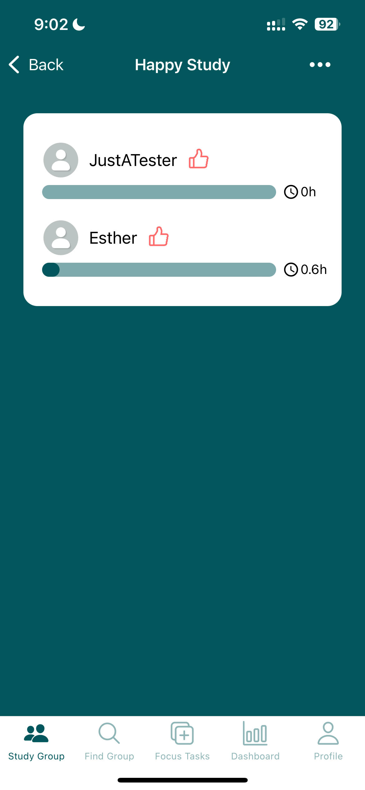

# StudySphere: Focus & Friends
NEU CS5520 Spring 2024
Group Members: Haoning Wang, Zhixiao Wang

## App Description
*Elevate Your Learning with StudySphere: Focus & Friends – Where Focus Meets Friendship!* 😉

In today's fast-paced world, finding the right balance between **productivity** and **social interaction** can be challenging. StudySphere: Focus & Friends is here to revolutionize the way you study, track, and share your academic journey! This innovative app combines the proven effectiveness of focused study sessions with the motivational power of social connectivity, making it the perfect tool for anyone looking to enhance their learning!

StudySphere: Focus & Friends is mainly designed for students aged above 14 who are seeking to improve their study habits and eager to use technology for a more organized, efficient, and interactive study experience.

## Current State
### Iteration 1 (March 28, 2024)
* Functionality Implementation
  * **Focus Tasks**: 
     * **Addition**: Users can add a new personalized focus task. All focus tasks are displayed on the main screen for easy access.
     * **Modification**: By tapping the left part of each focus task card, users can edit or delete the task as needed.
     * **Start a Focus Session**: The "Start" button on the right initiates a distraction-free study session (Pomodoro) with a countdown timer.
     * **Session Completion**: Users can choose to leave the session before the countdown ends or let it finish automatically.
     * **Reminders**: Users can create or delete a reminder. (Note: Currently, notifications for reminders are not supported)
     * **Completion Tracking**: Each focus task displays the number of times it has been completed without interruption.
  * **Groups**:
     * **Study Group Creation**: Users can create a new study group.
     * **Study Group Discovery**: Users can search for and join study groups. 
     * **Membership**: Users can leave a previously joined study group.
     * **Study Time Display**: Display the user's study time for the day alongside the study times of other group members.
     * **Member Interaction**: Users can acknowledge other members' achievements with a "like" feature.
  * **Dashboard**:
    * **Daily Overview**: Provide a summary of the user’s daily study activities, including total study hours, the number of breaks taken, and the number of sessions completed without interruptions.
    * **Focus Task Time Distribution**: Display the proportion of study time dedicated to each focus task on a pie chart.
    * **Weekly Study Time Distribution**: Display the distribution of the user's study time over the week on a bar chart.
  * **Profile**: 
    * **Personal Information Display**: Users can view their name, email, and avatar. (Note: Avatar switching is currently not available)
    * **Username Modification**: Users can  edit their username for personalization.

* Navigation Implementation and CRUD operations to Firestore
   * Auth Stack Navigator
     * This navigator is the entry point for unauthenticated users, directing them to either log in or sign up. It incorporates two screens, LoginScreen and SignupScreen, ensuring users can securely access their accounts or create new ones. The Auth Stack Navigator is conditionally rendered based on the authentication state managed through Firebase Authentication. If a user is not authenticated, this navigator is displayed, guiding the user through the authentication process.
   * App Tab Navigator
     * Upon successful authentication, the App Tab Navigator becomes the heart of the application's user interface. It organizes the app's main features into five tabs: Focus List, Study Group, Find Group, Dashboard, and Profile. This navigator enhances the user experience by providing a bottom tab bar for easy navigation between the app's primary features.
   * Focus Stack Navigator
     *  Nested within the App Tab Navigator, the Focus Stack Navigator handles the navigation related to focus tasks. It starts with the FocusScreen, where users can manage their focus tasks. The StandbyScreen is accessible from here, presented modally, to offer users a distraction-free environment for focused study sessions.
   * Group Stack Navigator
     * Nested within the App Tab Navigator, the Group Stack Navigator manages study groups. It begins with the StudyGroupScreen, allowing users to explore and manage their study groups. The GroupDetailsScreen provides detailed information about a specific study group. This navigator illustrates the application's group management features, including joining, creating, and interacting with study groups.
   * Firestore CRUD Operations
     * **Authentication Data**: Manage user accounts, including sign-up and login。
     * **Focus Tasks and Study Sessions**: Users can create, read, update, and delete focus tasks. Each completion or interruption of a study session is tracked and stored in Firestore, allowing for performance analysis and display on the Dashboard.
     * **Study Groups**: The application supports creating new study groups, joining existing ones, and managing group memberships. All group-related data, including member study times, is handled through Firestore。
     * **User Profile and Preferences**: User-specific information are managed through Firestore. Users can update their profile usernames.

* Data Model (Collections)
  * **Users Collection**
    * userEmail: String (user's email)
    * userName: String (user's name)
    * status(Optional): String
    * avatar(Optional): String (URL to the user's avatar image)
    * reminder(Optional): An array of objects or strings indicating reminder times and their repeat patterns
    * groups(Optional): An array of objects where each object represents a group the user has interacted with (either by joining or requesting to join).
  * **Focus Collection** (A Sub-collection of User collection)
    * title: String
    * duration: Integer (Expected duration to complete the task, in minutes)
    * location(Optional): An array of objects
    * lastUpdate: Timestamp(when the focus was completed last time)
    * todayBreaks: Integer (Number of breaks today)
    * todayTimes: Integer (Number of completion times today)
    * weeklyStudyTime: An array of length 7
    * monthlyStudyTime: An array of length 12
  * **Groups Collection**
    * groupName: String (name of the study group)
    * groupMembers: Array of Objects (each object contains user details and join status)
    * groupOwnerId: String (Document ID of the group owner, referencing a User document)

* CRUD Operations on Collections
   * User Collection
     * **Create**: When a new user signs up, their user details (including userEmail, userName, optional status, optional avatar, and any reminder settings) are created and stored in the Users collection.
     * **Read**: User-specific information is read for profile displays, including their email, name, avatar. The user's group memberships are also read to display the groups they are a part of.
     * **Update**: Users can edit their username, which updates the userName field in the Users collection. If a user sets or modifies reminders, this would update the reminder field. Joining or leaving groups would update the groups field.
     * **Delete**: Deleting a reminder would remove that specific entry from the reminder field in the Users collection. If a user decides to leave a group, that group's information would be removed from the groups field.
   *  Focus Collection (A Sub-collection of the User collection)
      * **Create**: When a user adds a new focus task, a new document is created in the Focus sub-collection with details such as title, duration, optional location, lastUpdate, todayBreaks, todayTimes, weeklyStudyTime, and monthlyStudyTime.
      * **Read**: The app reads the Focus sub-collection to display all focus tasks on the main screen, including details like title and duration, and to show completion tracking such as breaks and completions.
      * **Update**: Editing a focus task (title or duration) updates the respective document in the Focus sub-collection. Starting a focus session and either completing it or taking a break updates lastUpdate, todayBreaks, todayTimes, and potentially weeklyStudyTime and monthlyStudyTime fields.
      * **Delete**: When a user deletes a focus task, that specific document is removed from the Focus sub-collection.
    * Groups Collection
      * **Create**: Creating a new study group involves creating a new document in the Groups collection with details like groupName, groupMembers, and groupOwnerId.
      * **Read**: The app reads from the Groups collection to display available study groups for users to join, to show the user's study time alongside other group members, and to allow users to see the details of groups they have joined or are exploring.
      * **Update**: Joining a study group would add a user's details to the groupMembers array of a specific group document. Leaving a group would involve updating the groupMembers field to remove the user.
      * **Delete**: When the owner of a group decides to leave the group, the entire group document is deleted from the Groups collection.
## Member Contribution
* Haoning: mainly handled the code related to **study groups** and **dashboard**, including implementing Signup Screen, Login Screen, Study Groups Screen, Group Details Screen, Find Group Screen, Dashboard Screen and so on. Also wrote some common functions and components that could be reused by other team members.
* Zhixiao: mainly handled the code related to **focus tasks** and **user profile**, including implementing Focus Tasks Screen, Standby Screen, Profile Screen and so on. Also wrote some documents like README file, and made the drafts of the app's design.

## User Guide
* The home screen (Focus Tasks Screen) displays all the focus tasks. Note: the number next to the tick icon represents how many times this focus task has been completed.
  
* Users can add a new focus task by tapping the add button in the top right.
  
*  By tapping the left part of each focus task card, users can edit or delete the task as needed.
  
  
* The "Start" button on the right initiates a distraction-free study session (Pomodoro) with a countdown timer
  
  
* The Study Groups Screen will display all the groups you createded or joined. Users can quit a group by tapping the button in the top right.
  
  

* Search a Group and join it.
  
  
  

* In each group, users can see their own and each member's study time.
  

* Display data analysis on the dashboard.
  
  
  
* Display user information on the Profile Screen. Users can edit their usernames.
  
  
